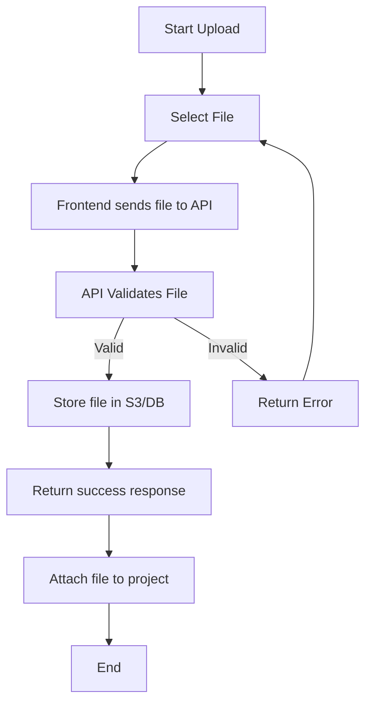

# Activity Diagram – File Upload Process (Optional)

```mermaid
flowchart TD
    A[Start Upload] --> B[Select File]
    B --> C[Frontend sends file to API]
    C --> D[API Validates File]
    D -->|Valid| E[Store file in S3/DB]
    E --> F[Return success response]
    F --> G[Attach file to project]
    G --> H[End]
    D -->|Invalid| I[Return Error]
    I --> B
```
