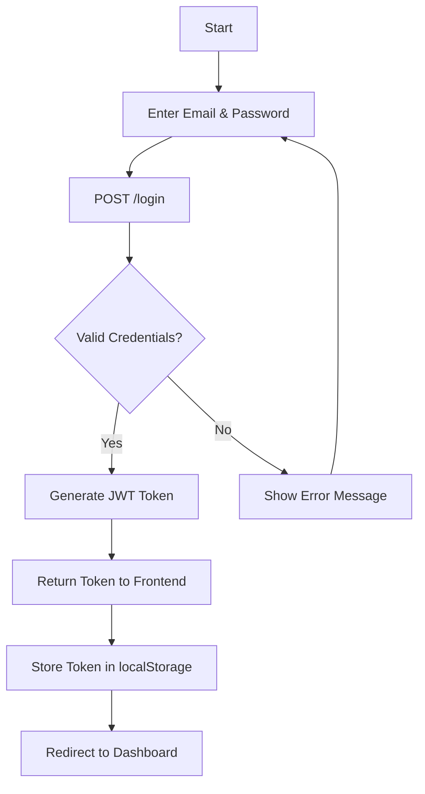

# Activity Diagram – Login Process

```mermaid
flowchart TD
    A[Start] --> B[Enter Email & Password]
    B --> C[POST /login]
    C --> D{Valid Credentials?}
    D -- Yes --> E[Generate JWT Token]
    E --> F[Return Token to Frontend]
    F --> G[Store Token in localStorage]
    G --> H[Redirect to Dashboard]
    D -- No --> I[Show Error Message]
    I --> B
```
