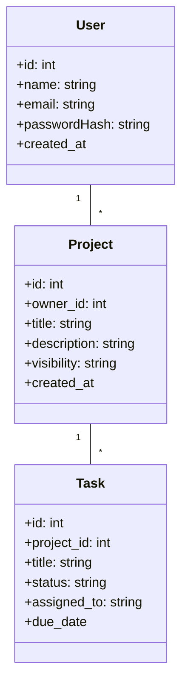

# Class Diagram

```mermaid
classDiagram
    class User {
        +id: int
        +name: string
        +email: string
        +passwordHash: string
        +created_at
    }

    class Project {
        +id: int
        +owner_id: int
        +title: string
        +description: string
        +visibility: string
        +created_at
    }

    class Task {
        +id: int
        +project_id: int
        +title: string
        +status: string
        +assigned_to: string
        +due_date
    }

    User "1" -- "*" Project
    Project "1" -- "*" Task
```
