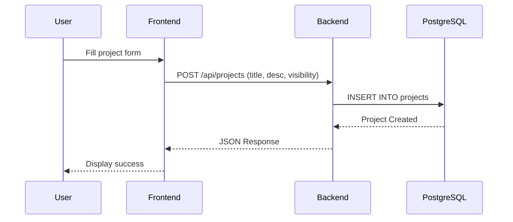

# Sequence Diagram – Create Project

```mermaid
sequenceDiagram
    participant U as User
    participant FE as Frontend
    participant API as Backend
    participant DB as PostgreSQL

    U->>FE: Fill project form
    FE->>API: POST /api/projects (title, desc, visibility)
    API->>DB: INSERT INTO projects
    DB-->>API: Project Created
    API-->>FE: JSON Response
    FE-->>U: Display success
```
